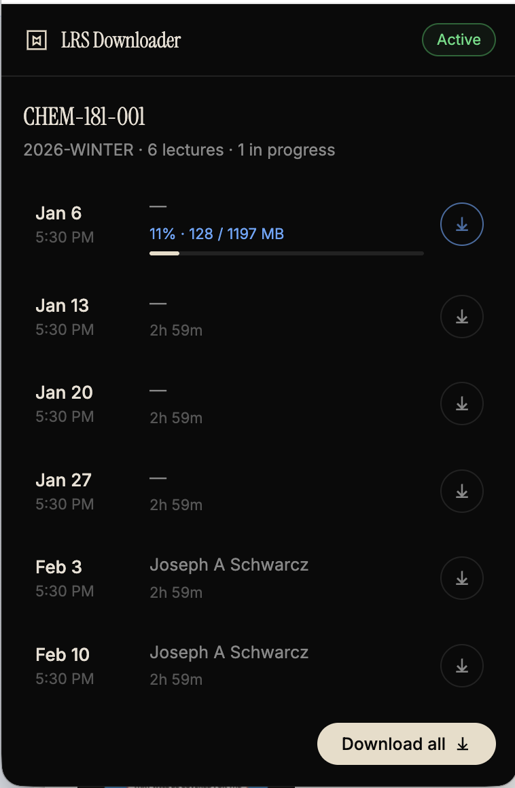

# McGill LRS Downloader

A Chrome extension that downloads lecture recordings from McGill's Lecture Recording System (LRS). Just open any course's recordings page on myCourses — the extension automatically detects your session and lets you download lectures with real-time progress tracking.



## Features

- **Zero setup** — automatically captures your authentication token when you visit a course's LRS page
- **One-click downloads** — download individual lectures or all at once
- **Real-time progress** — see download percentage, MB transferred, and a progress bar
- **Sequential batch downloads** — "Download all" queues lectures one at a time to avoid overwhelming the CDN
- **Smart file naming** — saves as `CourseName_Date_Instructor.ts` in a `McGill-Lectures` folder

## Installation

1. Clone or download this repository
2. Open `chrome://extensions` in Chrome
3. Enable **Developer mode** (toggle in the top right)
4. Click **Load unpacked** and select this folder
5. Pin the extension to your toolbar for easy access

## Usage

1. Go to [myCourses](https://mycourses2.mcgill.ca) and open any course
2. Navigate to **Lecture Recordings** (Content → Lecture Recordings)
3. Click the extension icon — it should show **Active** and list all recordings
4. Click the download button on any recording, or hit **Download all**

The extension saves files to your default downloads folder under `McGill-Lectures/`.

## How It Works

The extension uses a multi-layer approach to work within Chrome's Manifest V3 constraints:

1. **Token capture** — A content script running in the page's JS context (`MAIN` world) patches `fetch` and `XMLHttpRequest` to intercept JWT tokens sent to McGill's LRS API. A bridge script in the `ISOLATED` world relays these to the background service worker. A `webRequest` listener acts as a backup capture method.

2. **Recording discovery** — The service worker uses the captured JWT to call the LRS API and fetch the list of recordings for the course.

3. **Download pipeline** — Each recording has an HLS manifest pointing to a `.ts` media file on McGill's CDN. The service worker fetches the video directly (service workers have `host_permissions` that bypass CORS restrictions), streams it with progress tracking, then hands the completed blob to `chrome.downloads` for saving to disk.

## Project Structure

```
├── manifest.json      # Extension config (Manifest V3)
├── background.js      # Service worker: token storage, API calls, downloads
├── intercept.js       # Content script (MAIN world): patches fetch/XHR
├── bridge.js          # Content script (ISOLATED world): relays tokens
├── popup.html         # Extension popup UI
├── popup.css          # Styles
├── popup.js           # Popup logic and progress updates
└── icons/             # Extension icons (16, 48, 128px)
```

## License

[MIT](LICENSE)
